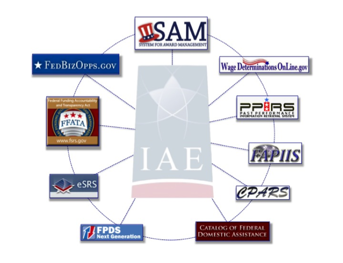

### About IAE

The Integrated Award Environment (IAE) is a Presidential E-Government initiative managed by the General Services Administration (GSA). The IAE uses innovative processes and technologies to improve systems and operations for those who award, administer, or receive federal financial assistance (i.e., grants, loans), contracts, and intergovernmental transactions.

####IAE Principles

IAE operates under a set of principles to ensure our work is focused, productive, and mission-driven.

The IAE Architectural Principles:

+ IAE Must be Open
+ We Must Always Treat Data as an Asset
+ We Will Use Continuous Improvement to Drive Innovation
+ IAE Will Provide an Effective User Experience for All Stakeholders
+ Business Transactions Must be Time- and Cost-Measurable
+ IAE Will Treat Security as Foundational
+ We Will Build Value Over Maintaining the Status Quo

The IAE Collaboration Principles:
* We Are Transparent
* We Are Curious
* We Are Team-Oriented
* We Work Flatter Across Boundaries
* We Have Honest Conversations
* We Are Agile, Risk-Attentive, and Knowledge-Hungry
* We Listen to Understand
* We Value Face to Face Conversation
* We Seek to Work Ourselves Out of a Job
* We Are Empowered and Forthcoming

####IAE Systems

####IAE Mission

The IAE Mission is to support a common, secure business environment which facilitates and supports cost-effective acquisition of, and payment for, goods and services; effective management of federal acquisition and assistance awards; and consistent transparency into federal acquisition and assistance awards.
For more information about IAE, including governance structure, please visit [gsa.gov/iae](http://www.gsa.gov/iae).

