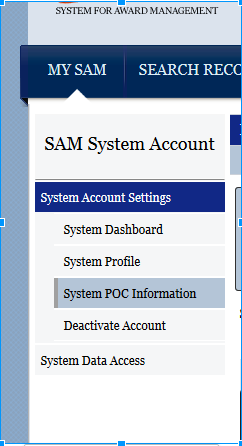
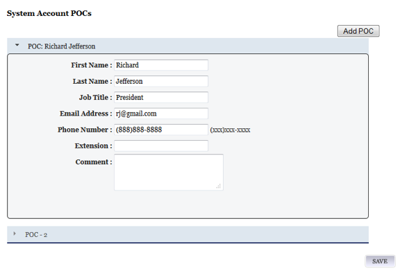
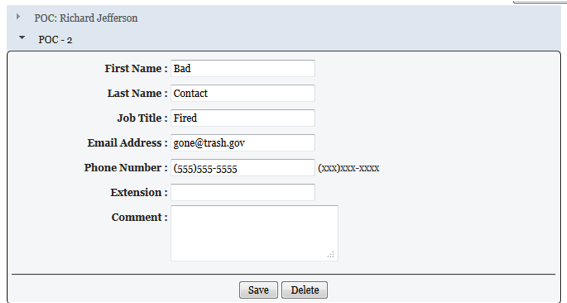

####Appendix A – How to Update System Account POCs
A SAM system account is for a System-to-SAM connection.  It has the following characteristics: 

+ Represents a particular information technology (IT) system
+ Is primarily for systems which need to send data to SAM (such as a contract writing system) or wish to automate the pull of the data through extracts or web services.
+ Is useful if multiple users in your organization need to access the same extract or web service.

System account points of contact (POC) are authorized administrators of the account.  A system account must have at least 1, but up to 3 POCs.  It is imperative that POCs keep this list up-to-date on a regular basis to account for new team members.  To update, please do the following:

1. Log into SAM.gov
2. In the MY SAM menu select System Account Settings > System POC Information

3. You will see a list of POCs.  To add a POC, click the Add POC button.  
To update information, update the relevant boxes (First Name, Last Name) and click the SAVE button.

4. To delete a POC, select the POC and click the Delete button.  Please note, you may not delete the first POC.  
If the first POC is gone, you must change that POC.  You may remove the 2nd and 3rd POCs.

 
