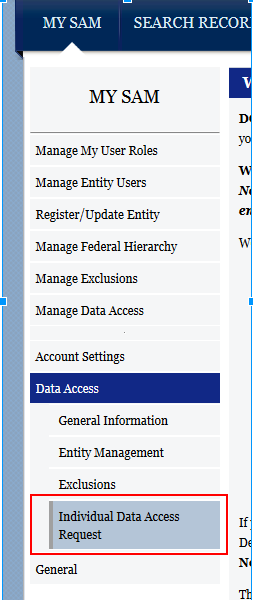
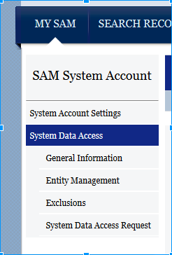
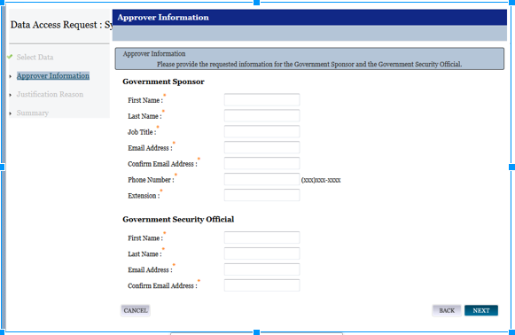
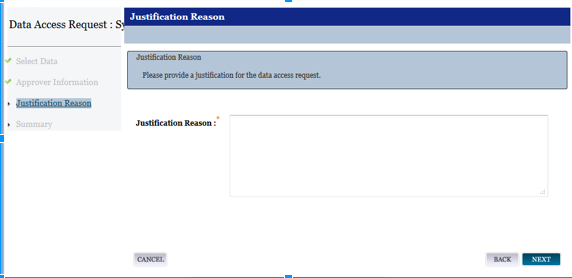

###SAM Data Access Request

####SAM Roles and Access
SAM provides a number of roles to fit the needs of users based on mission requirements and need-to-know.  For those users needing public information (governed by the Freedom of Information Act (FOIA)), there is no need to even have a SAM account to use the website.  Others needing more sensitive information to use in their Federal government systems, such as Taxpayer Identification Number (TIN) or registrant banking information will need to submit a data access request on-line in SAM to gain the required role.

#####SAM Role Definitions

| SAM Role | Definitions |
|---|---|
| Public / No SAM Account | A user that has not created a SAM user account.  Public access only.|
| Authenticated User | A user that has created and activated a SAM individual or system user account, but has not requested any specific data access role.   Note: Federal government users who create their SAM user account using their Federal government e-mail address automatically have the ability to view For Official User Only (FOUO) information on the SAM.gov website including those registrants who opted out of public search, registrant’s TIN, and the FOUO POCs. To see FOUO information, Federal government users need to log in before searching. |
| FOUO Entity Management Data Viewer | A user that has access to For Official Use Only (FOUO) information on the SAM.gov website, extracts, and web services.   FOUO information contained in the extracts and web services includes FOUO POCs, D&B Linkage, and D&B Monitoring.|
| Sensitive Entity Management Data Viewer | A user that has access to sensitive information on the SAM.gov website, extracts, and web services.  Sensitive information contained in the extracts and web services includes all FOUO information, plus the TIN (which is either an Employer Identification Number (EIN) or Social Security Number (SSN)), the U.S. banking information for Electronic Funds Transfer (EFT), and the MPIN.|

#####SAM Role-to-Access Matrix

| SAM Role | SAM Extract | SAM Web Service |
|---|---|---|
| No SAM Account | Entity Management Data Package Public* | No web service access |
| Authenticated User | Entity Management Data Package Public* | Entity Management Web Service Public |
| FOUO Entity Management Data Viewer | Entity Management Data Package FOUO | Entity Management Web Service FOUO | 
| Sensitive Entity Management Data Viewer | Entity Management Data Package Sensitive | Entity Management Web Service Sensitive |

Example: You are a Federal employee at USAID, working on a system that requires you to access vendor’s banking information.   You plan to download a daily file (extract) to your system so you can access the information locally.  You would need an extract that contains sensitive (financial) information.  You need the Entity Management Data Package Sensitive, which means you must request the Sensitive Entity Management Data Viewer role.
With the SAM roles, you will have access to the information on the website, the extract, and the web service.  There is no need for a separate request for each.  It is up to you how to consume the data.

####Data Access Request Process

The data access request process is where a SAM user requests access to information of a higher sensitivity level.  With the SAM roles, they may consume this data either by viewing it on the website, by downloading the extracts, or through the web services.  The users may have an individual or system account.
SAM system accounts may have up to 3 points of contact (POC).  Keeping POCs on your SAM system account updated is very important.  Only a POC is allowed to request a higher level of access to the SAM data.  For directions on updating POCs, please refer to Appendix A.
Please be advised. if you only have one POC listed on your SAM system account and that POC leaves your organization,  you will have to create another SAM system account. That is why we recommend maintaining all three POCs for a SAM system account.
For security reasons, SAM administrators may not alter system account information without the explicit consent of the account POC. If the POC separates or is no longer available to administer the account, another team member will have to generate a new SAM system account and initiate a new data access request.

#### Locating the Data Access Request for an Individual Account

1. Log into SAM.gov.
2. In the MY SAM menu, select Data Access > Individual Data Access Request

3. In the Select Data page, scroll down.  Select the Data Access Role and User Type, and then click NEXT.

Locating the Data Access Request for a System Account
Log into SAM.gov
In the MY SAM menu select System Data Access > System Data Access Request

In the Select Data page, scroll down.  Select the Data Access Role and then click NEXT.

##### Completing the Data Access Request form
From here, you must complete the Approver Information and Justification Reason sections.  This process is only a few minutes if you have the information ready.

**Government Sponsor/Supervisor** – A Federal government official must attest that the requestor requires the higher sensitive data to perform their duties and has the necessary permissions and clearances to do so.
**Government Security Official** – Due to the information SAM provides, all users must undergo a Security Training and Awareness as mandated by their agencies.  The security official will attest that the requestor has taken and passed this training.

**Justification Reason** – Please provide a concise rationale for requiring higher sensitivity data. Reference the specific non-public data elements you need and describe the Federal mission supported. Keep the explanation under 500 characters total, including spaces.

